# Cypher查询

说明：在我创建和导入的数据库当中，对于变量名当中的`;`，我都替换为`-`。
$e.g.$ `education;concentration;id`$\Longrightarrow $`education-concentration-id`

选择了最小的ego网络（编号：414）
整个图数据库的点和边如下：
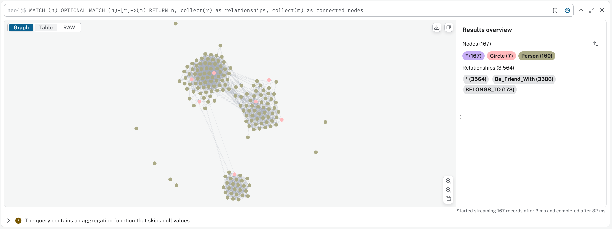

**1. 检索所有gender属性为77且education-degree-id为20的Person；**
查询语句：
```cypher
MATCH (p:Person)
WHERE p['education-degree-id'] = "20" AND p.gender = "77"
RETURN p
```
结果：
   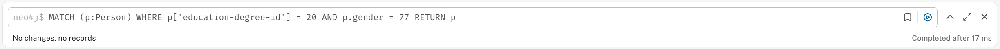

**2. 检索所有gender属性为78且education;degree;id为20或22的Person；**
查询语句：
```cypher
MATCH (p:Person)
WHERE p.gender = "78" 
    AND (p['education-degree-id'] = "20" OR p['education-degree-id'] = "22")
RETURN p
```
结果：
   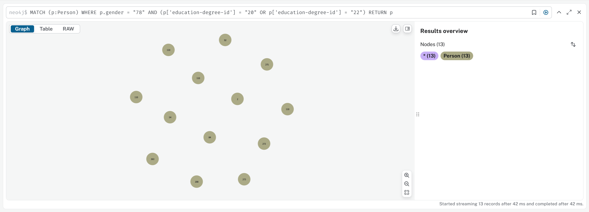
**3. 为Person增设年龄age属性，数值自行设定，可以随机化，要求年龄介于18岁-30岁之间，尽量分布均匀；**
查询语句：
```cypher
MATCH (p:Person)
SET p.age = toInteger(rand() * 13) + 18
RETURN p
```
结果：
   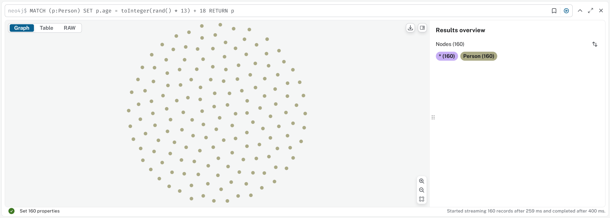

**4. 检索每个Person的朋友的数量；**
查询语句：
```cypher
MATCH (p:Person)-[:Be_Friend_With]->(friend:Person)
RETURN p.id AS person, count(friend) AS friend_count
ORDER BY friend_count DESC
```
结果：
   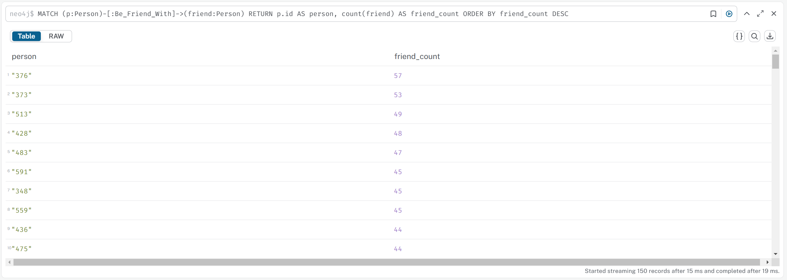

**5. 检索朋友平均年龄值在25岁以下的Person集合；**
查询语句：
```cypher
MATCH (p:Person)-[:Be_Friend_With]->(friend:Person)
WITH p, avg(friend.age) AS avg_friend_age
WHERE avg_friend_age < 25
RETURN p.id AS person, avg_friend_age
ORDER BY avg_friend_age
```
结果：
   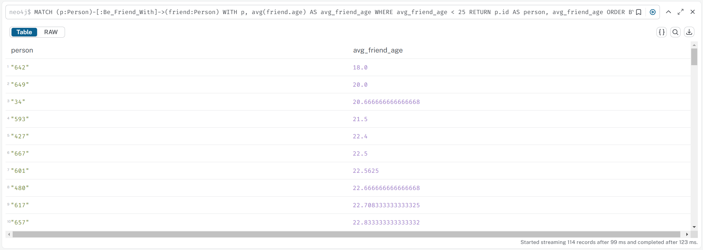

**6. 检索年龄最大的前10个Person；**
查询语句：
```cypher
MATCH (p:Person)
RETURN p.id AS person, p.age AS age
ORDER BY age DESC
LIMIT 10
```
结果：
   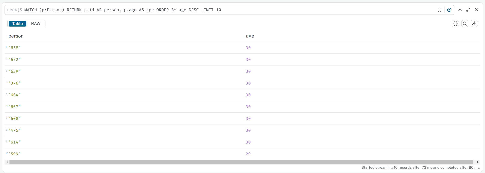

**7. 删除所有年龄为18和19的Person（删除之前请注意截图）**
查询语句：
删除前查询这些符合条件的点
```cypher
MATCH (p:Person)
WHERE p.age = 18 OR p.age = 19
RETURN p
```
执行删除
```cypher
MATCH (p:Person)
WHERE p.age = 18 OR p.age = 19
DETACH DELETE p
```
删除后再查一次
```cypher
MATCH (p:Person)
WHERE p.age = 18 OR p.age = 19
RETURN p
```
结果：
删除前：
   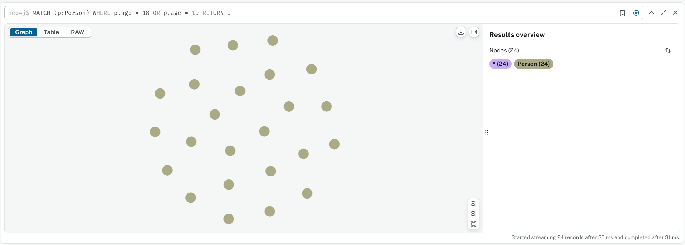
删除后：
   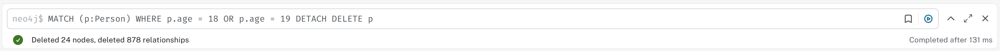
删除后再查一次：
   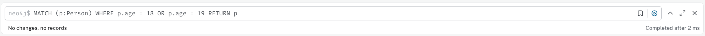

**8. 检索某个Person的所有朋友和这些朋友的所有朋友；**
查询语句：
先找找有哪些id
```cypher
MATCH (p:Person) RETURN p.id
```
然后挑一个id，执行查询，这里选id为573的Person，为了直观，我选择输出从573开始的所有路径
```cypher
MATCH path = (p:Person)-[:Be_Friend_With]->(friend:Person)-[:Be_Friend_With]->(friend_friend:Person)
WHERE p.id = "573"
RETURN path
```
结果：
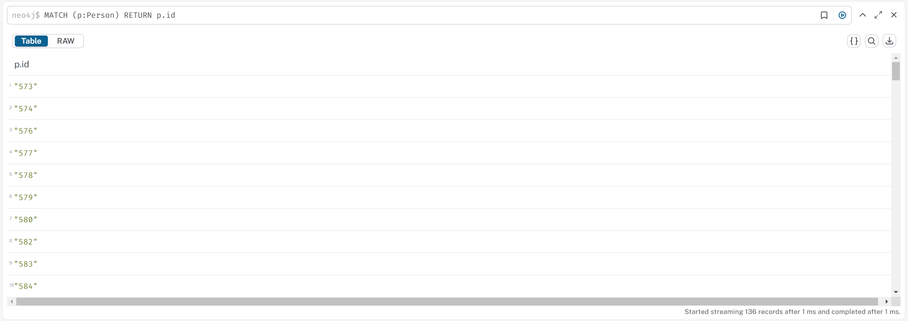
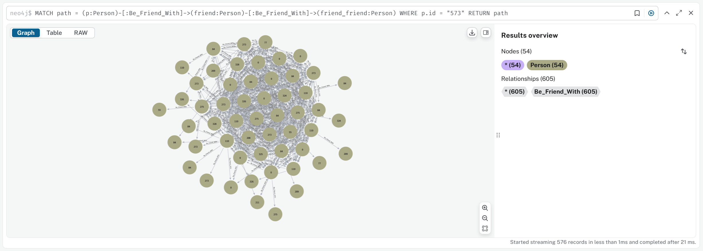

**9. 检索某个Person的所有朋友集合和其所在的circle的所有Person集合；**
查询语句：
选择上面一样的id，573，稍微修改一下就得到了573这个Person的朋友集合
```cypher
MATCH path = (p:Person)-[:Be_Friend_With]->(friend:Person)
WHERE p.id = "573"
RETURN path
```
circle的所有集合，为了直观，我选择返回的是path，这样能产生一个点和边的图
```cypher
MATCH path = (target:Person {id: "573"})-[:BELONGS_TO]->(circle:Circle)<-[:BELONGS_TO]-(circleMember:Person)
RETURN path
```
结果：
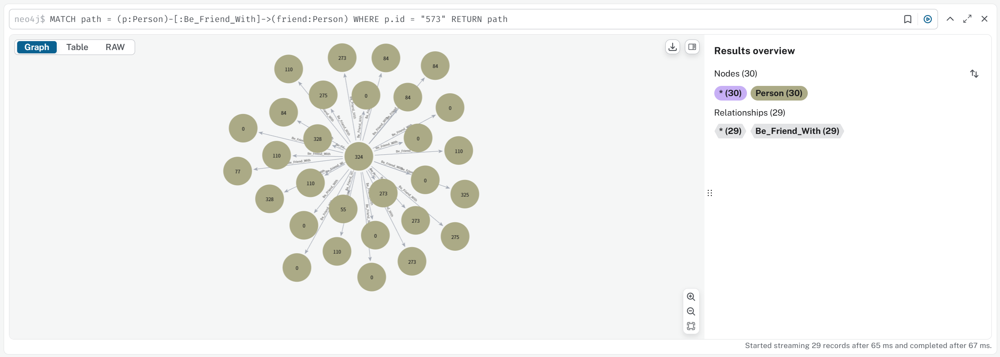
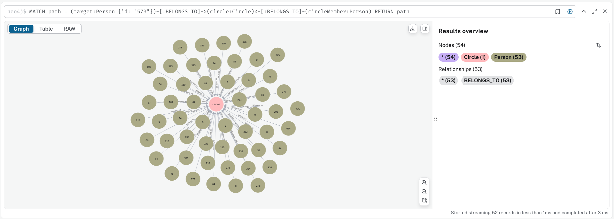

**10. 任选三对Person，查找每一对Person间的最短关系链（即图模型的最短路）；**
查询语句：
先挑6个id，然后相邻的两个凑成一对：573, 400, 376, 666, 566, 434（也不知道通不通）
```cypher
MATCH (p1:Person {id: "573"}), (p2:Person {id: "400"}),
p1p2 = shortestPath((p1)-[*]-(p2))
RETURN p1.id AS Person1, p2.id AS Person2, nodes(p1p2) AS ShortestPathNodes, relationships(p1p2) AS ShortestPathRelationships
UNION
MATCH (p3:Person {id: "376"}), (p4:Person {id: "666"}),
p3p4 = shortestPath((p3)-[*]-(p4))
RETURN p3.id AS Person1, p4.id AS Person2, nodes(p3p4) AS ShortestPathNodes, relationships(p3p4) AS ShortestPathRelationships
UNION
MATCH (p5:Person {id: "566"}), (p6:Person {id: "434"}),
p5p6 = shortestPath((p5)-[*]-(p6))
RETURN p5.id AS Person1, p6.id AS Person2, nodes(p5p6) AS ShortestPathNodes, relationships(p5p6) AS ShortestPathRelationships;
```
但是neo4j也给出了三个info：
   - 三个查询没有限制路径的长度，可能导致较长的查询时间
所以它建议对路径最大长度做出限制，比如限制最大路径长度为10，即：`MATCH path = shortestPath((p1)-[*..10]-(p2))`
但是鉴于第一次跑就成功跑出来了，所以我就不再尝试了。

结果：
    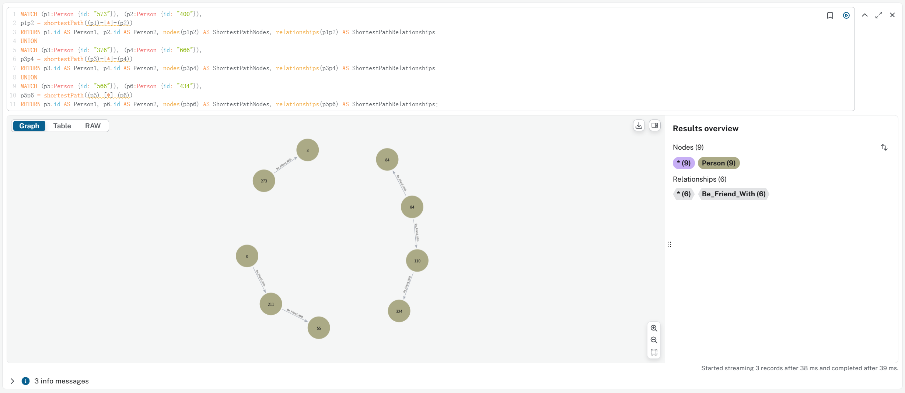

**11. 对于人数少于两个的circle，删除掉这些circle里的Person的表示circle信息的属性；**
不是很理解这道题，因为Person里面没有这类信息，Person和circle只是有个`BELONGS_TO`的关系，那就删关系吧，然后这个数据集circle没有人数是小于2个的，所以我就挑人数最小的circle，然后删掉这个circle和`BELONGS_TO`关系，保持Person不动。
查询语句：
首先先找到人数最少的circle
```cypher
MATCH path = (circle:Circle)<-[:BELONGS_TO]-(circleMember:Person)
WITH circle, count(circleMember) AS member_count, collect(path) AS paths ORDER BY member_count ASC
LIMIT 1
RETURN paths
```
然后删掉circle和对应Person的关系
```cypher
MATCH (circle:Circle)<-[:BELONGS_TO]-(circleMember:Person)
WITH circle, count(circleMember) AS member_count
ORDER BY member_count ASC
LIMIT 1
DETACH DELETE circle
```
结果：
先找到数量最少的circle：
    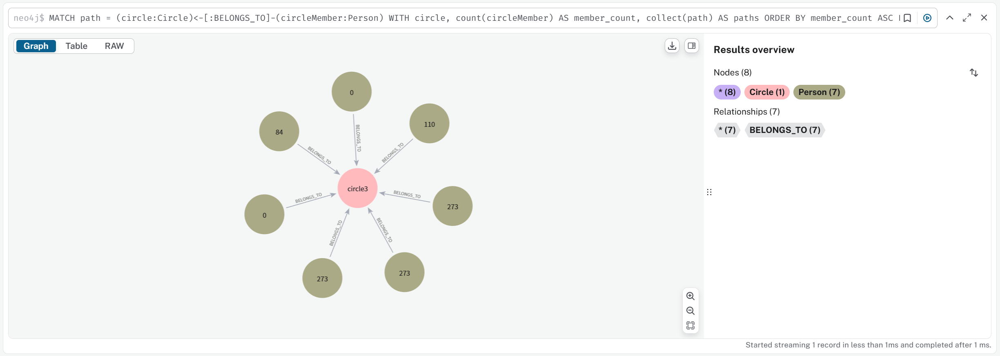
然后删掉这个circle：
    

**12. 按年龄排序升序所有Person后，再按hometown;id属性的字符串值降序排序，然后返回第5、6、7、8、9、10名Person，由于一些节点的hometown;id可能是空的（即没有这个属性），对于null值的节点要从排序列表里去掉；**
查询语句：
```cypher
MATCH (p:Person)
WHERE p['hometown-id'] IS NOT NULL
WITH p
ORDER BY p.age ASC, p['hometown-id'] DESC
SKIP 4
LIMIT 6
RETURN p.id, p.age, p['hometown-id']
```
结果：
   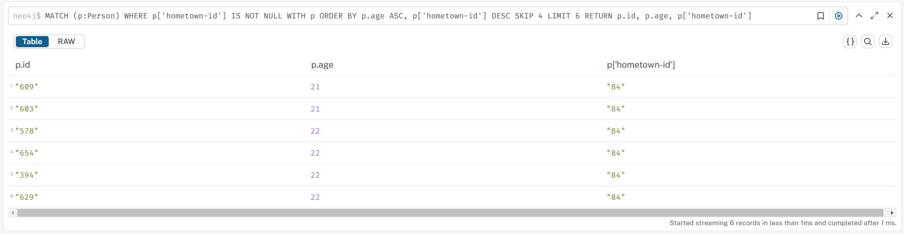

**13. 检索某个Person的二级和三级朋友集合（A的直接朋友（即有边连接）的称之为一级朋友，A的N级朋友的朋友称之为N+1级朋友，主要通过路径长度来区分，即A的N级朋友与A的所有路径中，有一条长度为N）**
查询语句：
这里也选择id为573的Person
```cypher
MATCH (target:Person {id: "573"})
MATCH path = (target)-[:Be_Friend_With*2..3]-(friend:Person)
RETURN path
```
结果：
   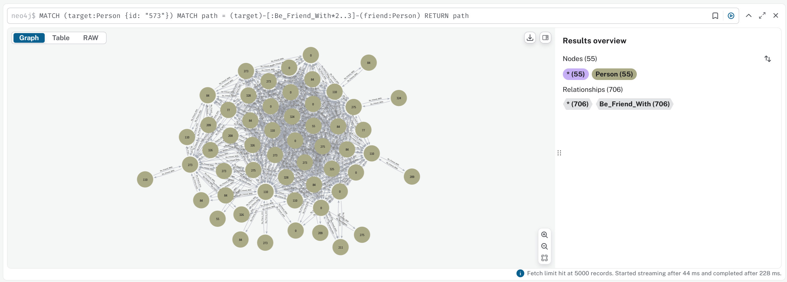

**14. 获取某个Person的所有朋友的education;school;id属性的list；**
查询语句：
这里也是选id为573
```cypher
MATCH (target:Person {id: "573"})-[:Be_Friend_With]-(friend:Person)
WITH friend, friend['education-school-id'] AS schoolId
RETURN friend.id AS friendId, schoolId
```
结果：
   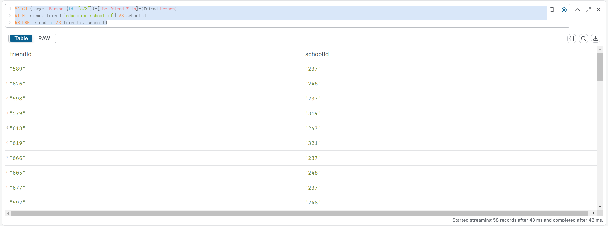

**15. 任选三对Person，查找每一对Person的关系路径中长度小于10的那些路径，检索出这些路径上年龄大于22的Person集合，在这一查询中，由于数据量及Person的选取问题，可能导致该查询难以计算出结果，因此可以将10这一数字下调至可计算的程度（自行决定，但请保证>=2），或者更换Person对；**
挑和第10道一样的三对：573, 400, 376, 666, 566, 434
从路径长度1\~2开始，逐渐往上尝试
```cypher
WITH ["573", "400"] AS pair1, ["376", "666"] AS pair2, ["566", "434"] AS pair3
UNWIND [pair1, pair2, pair3] AS pair
MATCH p = (p1:Person {id: pair[0]})-[*1..4]-(p2:Person {id: pair[1]})
WHERE ALL(n IN nodes(p) WHERE n.age > 22)
RETURN p1.id, p2.id, collect(nodes(p)) AS persons
```
结果：
1\~4就要查很久都出不来了（后来我动了一下然后卡死了），我这里给个1\~3
    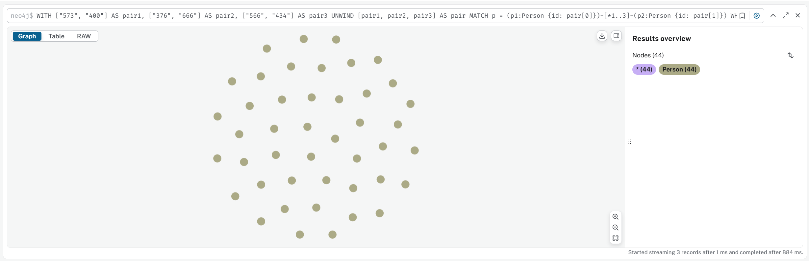